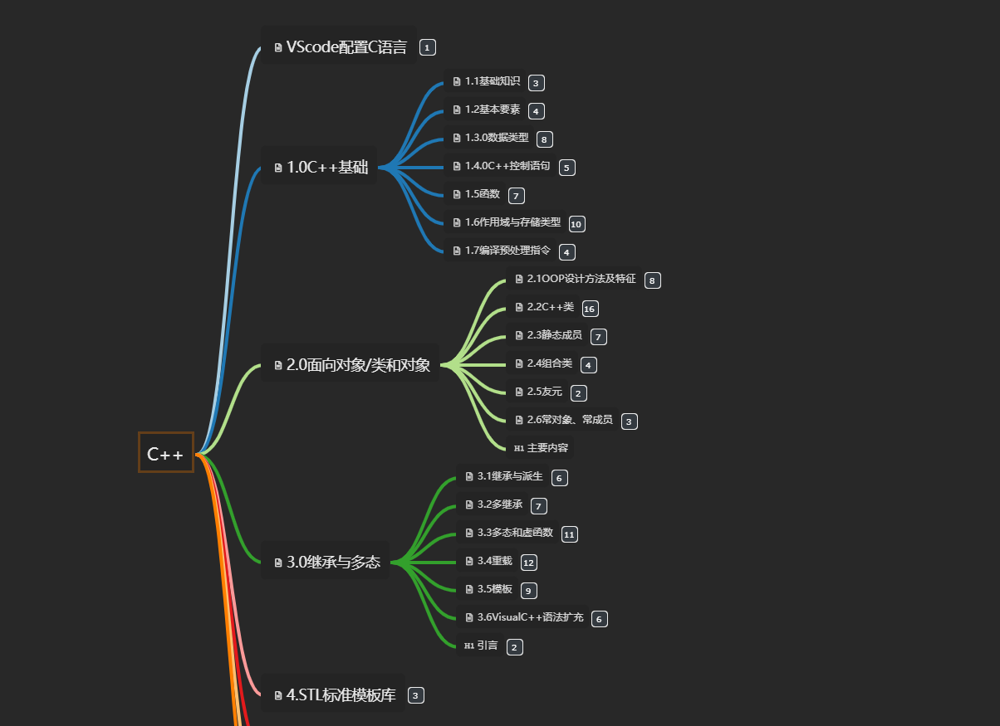
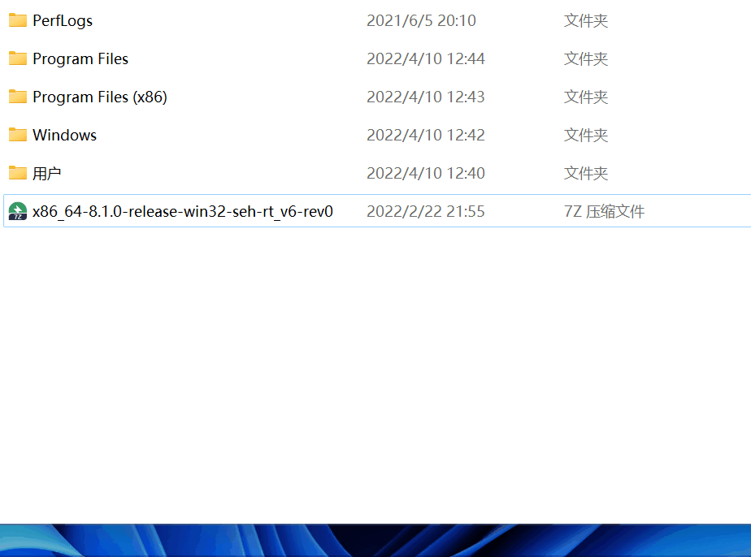
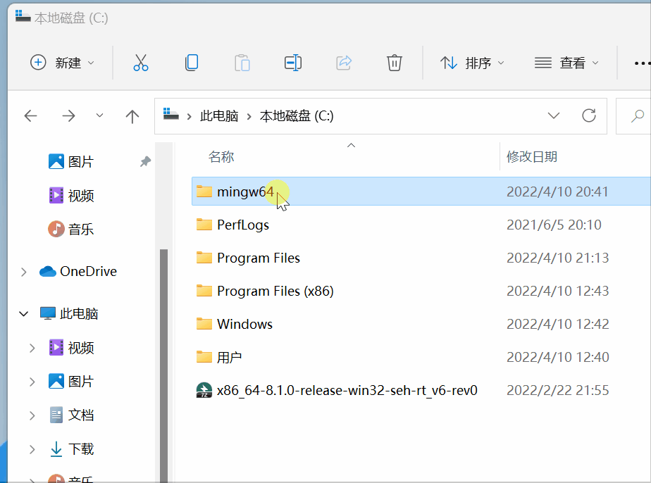
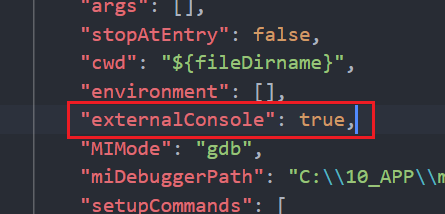
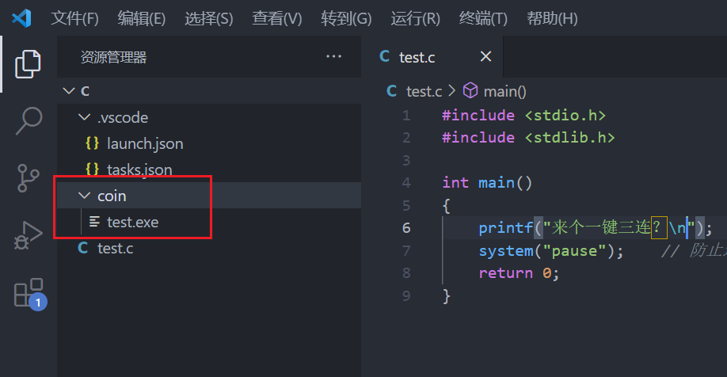

# **C/C++ 环境配置 及基础入门笔记**
# 思维导图
  

# VScode 中配置 C/C++ 环境
1. **下载编辑器 VScode**

- 官网：[https://code.visualstudio.com/](https://code.visualstudio.com/)（点链接时按下 Ctrl，不会覆盖当前页面哦^-^）
- 安装 VScode（建议附加任务全部勾选）
  

2.  ** 下载编译器 MinGW 并解压**
    官网页面：[https://www.mingw-w64.org/](https://www.mingw-w64.org/)
    下载页面：[https://sourceforge.net/projects/mingw-w64/files/](https://sourceforge.net/projects/mingw-w64/files/)

> 你可以进入官网自行寻找
> 你也可以直接点击为你找好的下载页面

- 下载页面中选择 x86_64-win32-seh 下载
  

> 如果你因为网络环境限制无法下载
> 不限速下载，请笑纳^-^：[https://wwn.lanzouh.com/iLOip031ku6b](https://wwn.lanzouh.com/iLOip031ku6b) 密码:1234

- 在 C 盘中解压文件
  

> 理论上你可以在任何地方解压，但注意路径不能包含中文，至于特殊字符请自行测试 3.  **将 MinGW 添加至环境变量**

- 进入 mingw64 下的 bin 文件夹，复制当前路径，Win + i 唤起系统设置，输入高级系统设置并进入，点击环境变量，选择 path，编辑，新建，粘贴路径，按下三个确定
  

4. **配置 VScode 插件**

- 打开 VScode 安装插件 Chinese 和 C/C++ ，等待安装完毕后重启 VScode
  

- 切换 C/C++插件至 1.8.4 版本
  

> 因最新版本不会自动生成 launch.json 文件，给后续优化带来不便，故退回旧版本。 5. **运行代码**

- 新建文件夹，修改为英文名称并进入，右键 通过 Code 打开 若在安装时未勾选相关选项，可能没有这个选项，请自行在 VScode 内操作打开文件夹
- 新建一个文件，英文命名且扩展名为 .c
- 编写相关代码

```
#include <stdio.h>
#include <stdlib.h>
int main()
{
    printf("Hello World!\n");
    printf("你好世界！\n");
    system("pause");    // 防止运行后自动退出，需头文件stdlib.h
    return 0;
}
```

- VScode 菜单栏，点击运行，启动调试，稍等程序运行，输出结果在下方终端，上方调试面板，点击最右边的 橙色方框 停止程序运行

6. **调整和优化**

> 请根据自己的需要进行优化
> 代码运行后 .vscode 文件夹会自动生成在你的源文件目录下
> .vscode 文件夹下的 task.json 和 launch.json 用来控制程序的运行和调试

- 将程序运行在外部控制台【推荐】
- 打开.vscode 文件夹下的 launch.json 文件，找到 "externalConsole": false, 将 false 改为 true 并保存
  
- 解决中文乱码问题【推荐】
- 打开.vscode 文件夹下的 task.json 文件，找到 `${fileDirname}\\${fileBasenameNoExtension}.exe` 在后面加上英文 逗号 然后回车到下一行，粘贴下面文本 `-fexec-charset=GBK` 并保存
  
- 收纳生成的 exe 可执行文件【可选】
- 打开.vscode 文件夹下的 task.json 文件，找到 `${fileDirname}\\${fileBasenameNoExtension}.exe`
  修改成 `${fileDirname}\\coin\\${fileBasenameNoExtension}.exe` 并保存，同理，`launch.json` 下也有相同的字段，需要你修改
- 在源文件同目录下新建 `coin` 文件夹，程序运行后，可执行文件将会生成在里面（其中 `coin` 可修改成你喜欢的英文名字）
  

> 这样 .c 文件一多起来的时候，就不会出现 .exe 和 .c 相互穿插在目录中^-^
